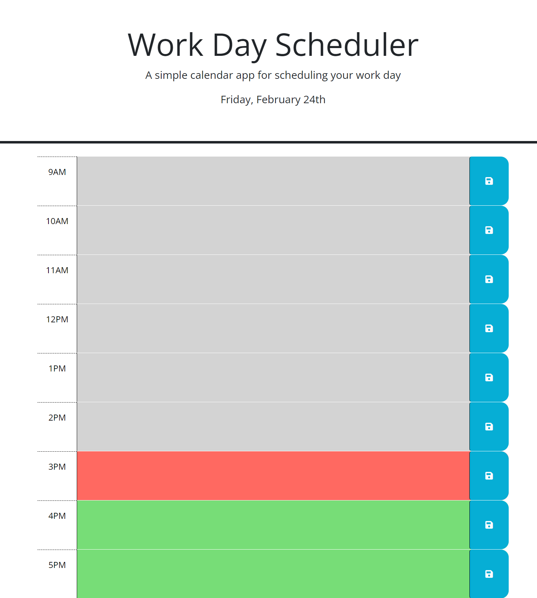
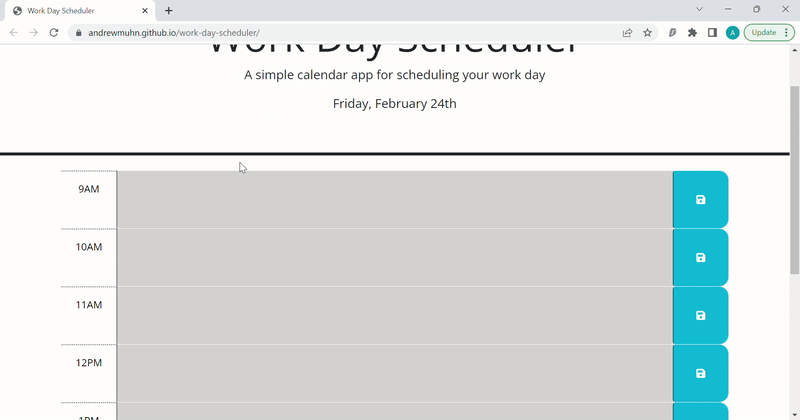

# <Work-Day-Scheduler>

## Description

- The goal was to make a simple schedule app that could receive tasks, save and render after a page refresh.
- I built this project to practice jquery development aswell as utilizing jqueryUI, and dayjs.
- This allows me the abilty to work on the plethora of web apps using jquery
- I learned how to utilize the map() function

## Usage

[Link to Deployed Application](https://andrewmuhn.github.io/work-day-scheduler/)

- demonstration of app saving, updating, and refreshing to show how information entered persists.
	- must hit save button to save or update information otherwise information will be lost on refresh or revert back to previous saved task

## Features

- date at the top of application loads current date
- coloring dependent on current time of day,
	- ie. if it is 12:32pm: 9-11am time blocks are gray, 12pm time block is red, and 1-5pm timeblocks are green

## Credits

Project of Andrew Muhn

Completed as part of EdX bootcamp
